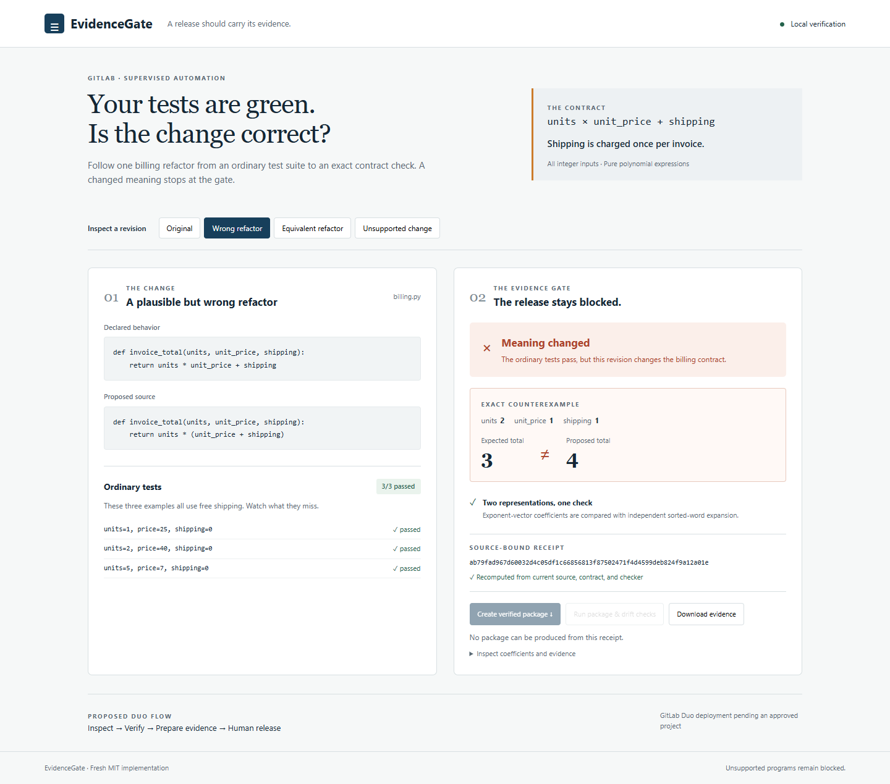

# EvidenceGate

**The example tests pass a wrong billing refactor. The release gate finds an exact counterexample and refuses to package it.**



EvidenceGate is a fresh MIT implementation for GitLab's Life After Code hackathon, Path A / Supervised Automation. It checks a deliberately restricted integer-polynomial contract and binds the checked source, contract and checker hashes to replayable evidence. A proposed GitLab Duo flow reads that evidence; human release remains a separate manual CI job.

## Run the actual demo

Python 3.12+, source checkout, no third-party runtime dependencies:

```sh
python -B -m evidencegate serve
```

Open <http://127.0.0.1:4187>. Choose **Wrong refactor**: `units*(unit_price+shipping)` passes the three free-shipping examples but changes the contract. Choose **Equivalent refactor** to create and download an actual ZIP containing checked source and its receipt. The unsupported example stays blocked.

```sh
python -B -m unittest discover -s tests -v
python -B -m evidencegate audit --out artifacts/contract.json
python -B -m evidencegate replay --receipt artifacts/contract.json
python -B -m evidencegate package --receipt artifacts/contract.json
```

[evidence/tests.txt](evidence/tests.txt) retains actual test output. [media/demo-local.webm](media/demo-local.webm) is a recording of local interactions. The demo is not a recording of GitLab Duo execution.

## Why this catches the change

The checker expands the expected and actual expressions into exponent-vector coefficient maps. A second expansion uses sorted variable words and must agree. A zero coefficient residual proves equivalence for every integer argument in the supported language. A nonzero residual produces an exact witness on a degree-complete grid; this is stronger than passing a fixed set of examples.

The module must contain exactly one undecorated positional function with a single return expression. Supported operations are bounded integer constants/arguments, `+`, `-`, `*` and literal nonnegative powers. Floats, division, calls, decorators, defaults, branches and module effects are unsupported and block packaging. This does not certify general Python programs or arbitrary business requirements.

Evidence receipts bind current source, contract and checker identity. Changing the source after a PASS causes packaging to fail on replay. The digest provides integrity binding, not a signed attestation.

## GitLab Duo integration

[.gitlab/duo/flows/evidence-gate.yaml](.gitlab/duo/flows/evidence-gate.yaml) is a custom v1 ambient flow with three components: review, verification and evidence packaging. It uses the documented `AgentComponent` and inline prompt schema. [.gitlab/duo/agent-config.yml](.gitlab/duo/agent-config.yml) keeps GitLab's default Agent Platform image and checks the included Python 3.12 runtime.

The local configuration has been reviewed against official documentation. **An approved hackathon GitLab project, a real Duo session and GitLab-hosted CI results are still required.** YAML parsing is not live platform validation.

To activate it in the approved project: push the repository to its default branch; create a custom flow in GitLab's AI Catalog using this YAML; enable it for the project and select a supported trigger; run it on a sample refactor. Retain the actual Duo session and pipeline links. See [docs/duo-demo.md](docs/duo-demo.md).

[.gitlab-ci.yml](.gitlab-ci.yml) runs tests, checks the mathematical contract, creates verified artifacts and offers `supervised_release` as a manual job. A blocked contract fails the verify stage and prevents downstream packaging. The Duo agent must not override that decision or modify the contract to obtain a pass.

## Provenance

All application/checker/flow code in this repository was written on 8 October 2026. This project reuses the author's evidence-first design experience; it does not copy NOETHER-FORGE or proprietary research archives. See [NEW_WORK.md](NEW_WORK.md). Codex assisted implementation and documentation. All claimed local outcomes are supported by executed checks.

## Reviewable demo and test build

The [English narrated local demo](media/demo-narrated.mp4) is under three minutes. Playback timing is visibly adjusted from the retained [original recording](media/demo-local.webm); the narration identifies local/control execution and any live integration still pending. A GitHub-hosted file does not replace the required public YouTube/Vimeo submission URL.

The complete Python source/test build is published through the repository release at `v0.1.0`. Extract it, open a terminal in the extracted folder, and follow the launch command above.

Run `python -B -m evidencegate staging --receipt artifacts/contract.json --out artifacts/staging.json` after a passing audit. This executes 18 billing HTTP canaries plus startup, drift rejection on both endpoints and recovery: 22 checks. The browser offers the same executed workflow.
